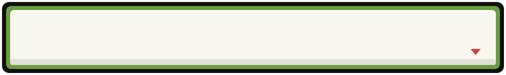

## ◓ Entrada da Pokédex

- 🦴 Criando o **Poke Idle** junto com a [@poke-legacy](https://github.com/poke-legacy)
- 🗼 Mexendo com servidores e ferramentas de **PokeTibia**
- 🌙 Habilidade passiva: **Coruja Noturna** (os melhores commits saem de madrugada)
- ✨ Pokémon favorito: **Marowak Shiny**, obviamente

## ⚔️ Meu Time

  

## 🏥 Centro Pokémon — Estatísticas

  

## 🐍 Um Ekans shiny selvagem está comendo minhas contribuições!

<picture>
  <source media="(prefers-color-scheme: dark)" srcset="https://raw.githubusercontent.com/douglasruann/douglasruann/output/ekans-dark.svg"/>
  <source media="(prefers-color-scheme: light)" srcset="https://raw.githubusercontent.com/douglasruann/douglasruann/output/ekans.svg"/>
  
</picture>

 

&nbsp;&nbsp;

<b>DOUGLAS RUAN salvou o jogo.</b> Obrigado pela visita, Treinador!

